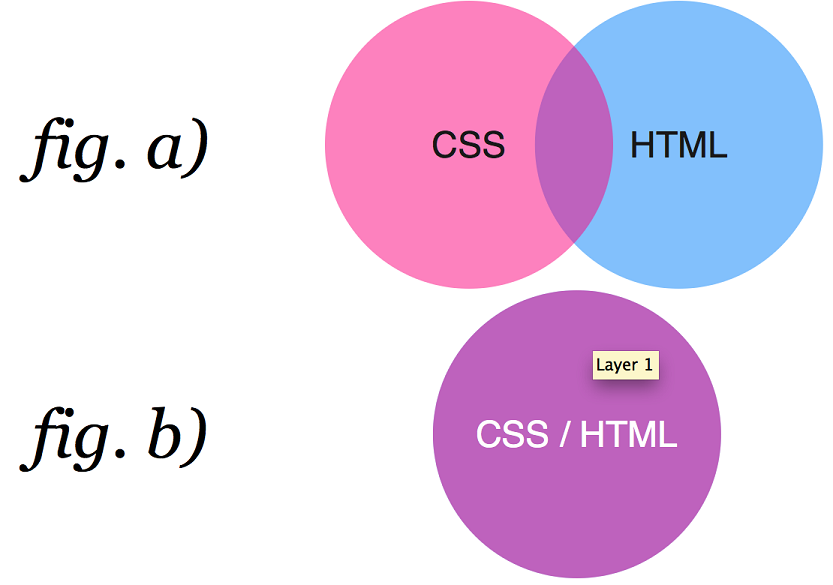

# gulp-check-unused-css

Check if all your defined CSS classes are used in your HTML files and vice versa.

## WAT?

Consider this picture:

Figure a) represents what you have now. Some classes are defined in your CSS, but never used in the templates. Some classes used in the templates don't appear in your CSS.

Figure b) represents what you actually want. Keeping your CSS and HTML clean improves maintainability of your code. Also you do not send useless bytes to your users, which makes your site loading (slightly, but still) faster.

``gulp-check-unused-css``, even though the name is misleading now, will check for the not overlapping parts of figure a) and throw an error if it encounters them.

## Installation

    npm install --save-dev gulp-check-unused-css

## Upgrading

In case you are upgrading from ``0.0.x`` you should really, REALLY read the docs again. Things that changed:

* How you put HTML files in the plugin
* What this plugin actually checks
* When the plugin throws errors
* How to prevent those errors from breaking your build
* Inverted meaning of ``angular`` option (now off by default)

So basically everything that's important has changed since. I didn't publish the two ``1.x.y`` versions, so no worries there.

## Usage

Simple use:

    var checkCSS = require( 'gulp-check-unused-css' );
    gulp
        .src([ 'styles/*.css', 'templates/*.html' ])
        .pipe( checkCSS() );

For advanced use with ``gulp-watch`` check out the [Gulpfile](Gulpfile.js).

The plugin will emit all files you put in (because it has to read all of them before checking), but occasionally break your pipe. This is good for automated build processes, e.g. in CI systems like Jenkins or Travis.

## Options

* ``ignore``: Array containing strings and/or regexes, if an unused class matches one of it, it is ignored.
* ``globals``: Array of strings identifying predefined sets of ignored classes.
* ``angular``: Boolean, passing ``true`` will turn the support for ``ng-class`` on.

## Ignoring classes

This plugin is inspired by the [workflow at Github](http://markdotto.com/2014/07/23/githubs-css/#linting), where a build fails if the classes used in the CSS and the templates do not overlap exactly. However, most of us do not write 100 % of the CSS ourselves but rely on frameworks such as Bootstrap. That's why there are some options available to ignore "global" or "vendor" classes.

You can provide a list of class names or regular expressions that should be ignored.

    gulp
        .src( 'app.*' )
        .pipe( checkCSS({
            ignore: [ 'special-js-class', /^vendor-/ ]
        }));

Since 1.1.0 you can also add ``globals: [ '{framework}@{version}' ]`` to your options.

    gulp
        .src( 'app.*' )
        .pipe( checkCSS({
            globals: [ 'bootstrap@3.2.0' ]
        }));

### Supported globals

* Bootstrap 3.2.0 (``bootstrap@3.2.0``)

## Development

    git clone gulp-check-unused-css
    cd gulp-check-unused-css
    npm install
    # hack hack hack
    npm test

### Add a global

0. Fork the project
1. Acquire CSS file
2. ``cd gulp-check-unused-css``
3. ``node util/extract.js --file { path to CSS file }``
4. Now there is a ``.ignore`` file (which is actually a CommonJS module) next to the file
5. Rename it appropriately to ``{framework}@{version}.js``
6. Save it to ``src/global``
7. Commit and submit a Pull Request

## Changelog

* ``2.0.0``: Check HTML files, other breaking changes. See [Upgrading](#upgrading)
* ``1.1.0``: Add support for frameworks
* ``1.0.0``: Join ``ignoreClassNames`` and ``ignoreClassPatterns`` to ``ignore``
* ``0.0.8``: Add support for AngularJS syntax
* ``0.0.7``: I don't remember
* ``0.0.6``: Add check for empty or invalid CSS files
* ``0.0.5``: Fix bug where media queries in the CSS broke everything
* ``0.0.4``: Fix bug where those options could not be used together
* ``0.0.3``: Introduce ``ignoreClassNames``, ``ignoreClassPatterns``
